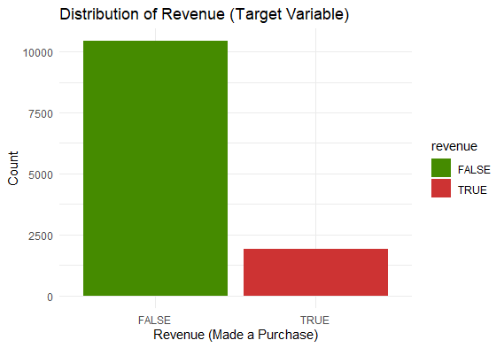
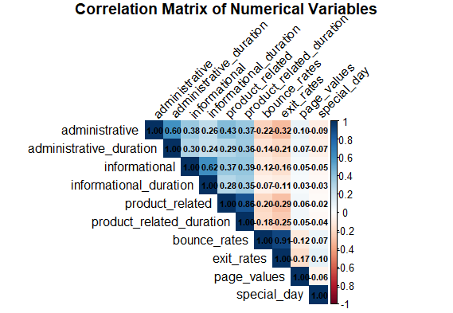
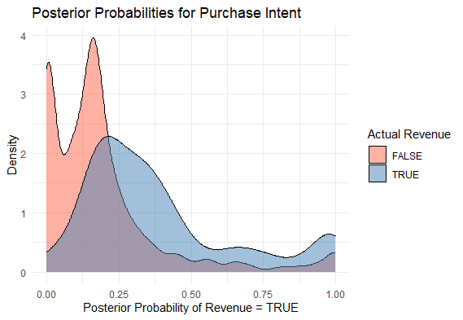

# Online Shoppers Purchasing Intention: Multivariate Analysis

This repository contains the code and report for the analysis of online shopper purchasing intention.

## Overview
A high number of website visitors does not always equate to high revenue. This project explores the behavioral patterns of online shoppers to identify specific actions associated with purchase intention. 

### Objectives
* **Dimensionality Reduction:** Use Principal Component Analysis (PCA) to reduce numerical metrics into smaller behavioral dimensions.
* **Evaluate Relationships:** Use Canonical Correlation Analysis (CCA) to explore the relationship between user activity and site analytics.
* **Predict Purchase Intention:** Use Quadratic Discriminant Analysis (QDA) to predict whether a visitor will make a purchase based on their session behavior.

## Dataset
The dataset contains feature vectors derived from 12,330 user sessions over a 1-year period, avoiding bias from specific campaigns or holidays. 
* **Target Variable:** `Revenue` (Boolean: True if the session ended with a purchase, False otherwise).
* **Class Imbalance:** 84.5% negative class (no purchase), 15.5% positive class (purchase).

## Methodology & Results

### 1. Exploratory Data Analysis
Visualized distributions and correlations among numerical and categorical variables.

  
  

### 2. Principal Component Analysis (PCA)
Reduced 10 numerical features into 4 principal components, explaining 71.58% of the total variance. 
* **PC1 (Engagement):** Captures general user engagement and time spent on product/administrative pages.
* **PC2 (Bounce Behavior):** Highly correlated with bounce and exit rates.

### 3. Canonical Correlation Analysis (CCA)
Analyzed the relationship between **User Actions** (administrative, informational, product-related) and **Site Analytics** (bounce rate, exit rate, page values). 
* **Finding:** High engagement in administrative and product tasks is associated with decreased bounce rates but leads to higher exit rates as sessions conclude.

### 4. Quadratic Discriminant Analysis (QDA)
A QDA classifier was implemented over LDA due to heterogeneous covariance matrices. 
* **Overall Accuracy:** 81.38%
* **Insight:** While overall accuracy is high, misclassification for actual buyers implies that browsing patterns for purchasers and non-purchasers can be quite similar.

  

## Technologies Used
* **R**
* **Libraries:** `dplyr`, `janitor`, `factoextra`, `corrplot`, `ggplot2`, `tidyverse`, `CCA`, `heplots`, `MASS`, `caret`, `CCP`
